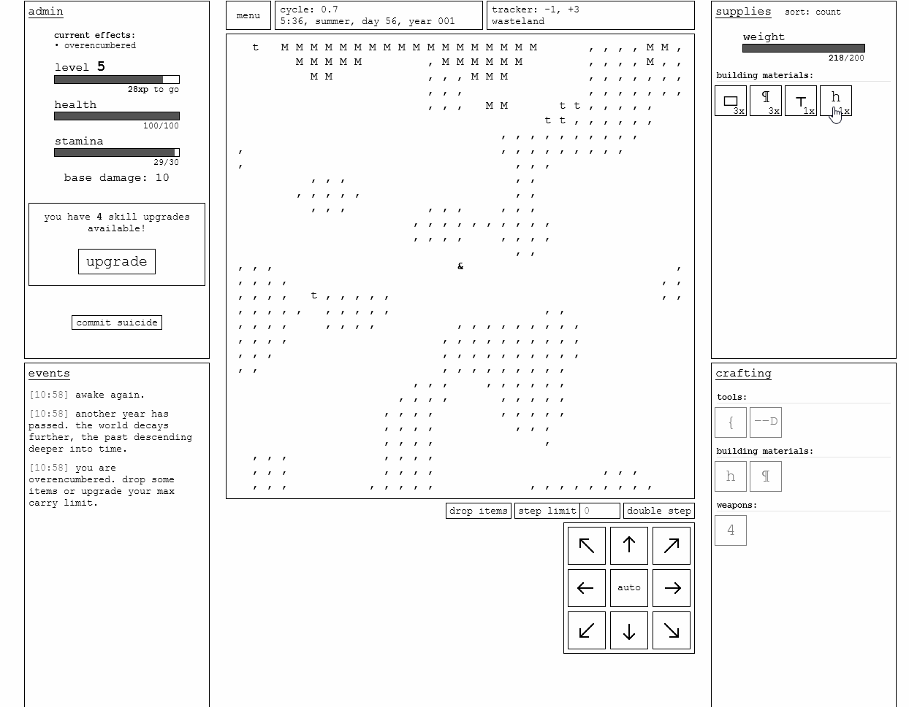

# Explorables Plugin

Create structures that generate custom maps when entered.



## Example usage

1. Create a structure using [the-travelers-plus](https://github.com/LightningWB/the-travelers-plus)

2. Add an explorable blueprint to the structure so you can enter it with emit("explorables", "load", [STRUCTURE_ID], [BLUEPRINT_OBJ])

```js
const { emit, makePlugin } = global.plugins;

const plugin = makePlugin("example");

// Explorable Blueprint
const blueprint = {
  // Unique explorable name
  type: "small_home",
  // Width of explorable (max 98)
  width: 5,
  // Height of explorable (max 98)
  height: 5,
  // Array of structureIds used in explorable (an exit structure is required is you want to leave the explorable)
  pallete: ["wood_block", "exit"],
  // Layout of the explorable using indices from the pallete (-1 is an empty space)
  layout: [
    0,  0,  0,  0, 0,
    0, -1, -1, -1, 0,
    0, -1, -1, -1, 0,
    0, -1, -1, -1, 0,
    0,  0,  0,  0, 0
  ],
};

plugin.on("ready", () => {
    ////////////////////////
   // the-travelers-plus //
  ////////////////////////

  // Create Game Item
  emit("travelers", "addGameItem", "home", {
    "name": "small_home",
    "title": "small home",
    "type": "build",
    "weight": 100,
    "icon": "h",
    "desc": "a small home that can be entered",
    "craft": true,
    "craft_time": 2,
    "craft_data": {
        "wood_block": {
            "count": 1,
            "title": "wood block"
        }
    },
    "build": true,
    "build_desc": "when placed, you will be able to enter the home."
  });

  // Add structure properties to item
  emit("travelers", "addStructureData", {
    id: "home",
    placingItem: "home",
    char: "h",
    breakTime: 2,
    isBreakable: true
  });

  // OPTIONAL - Make it craftable
  emit("travelers", "addCraftableItem", "home", 1);


    /////////////////
   // Explorables //
  /////////////////

  // Make the structure explorable
  emit("explorables", "load", "home", blueprint);
});

```